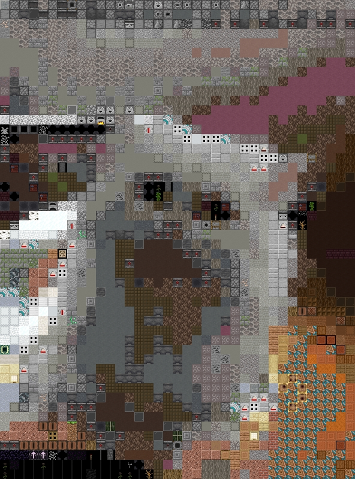
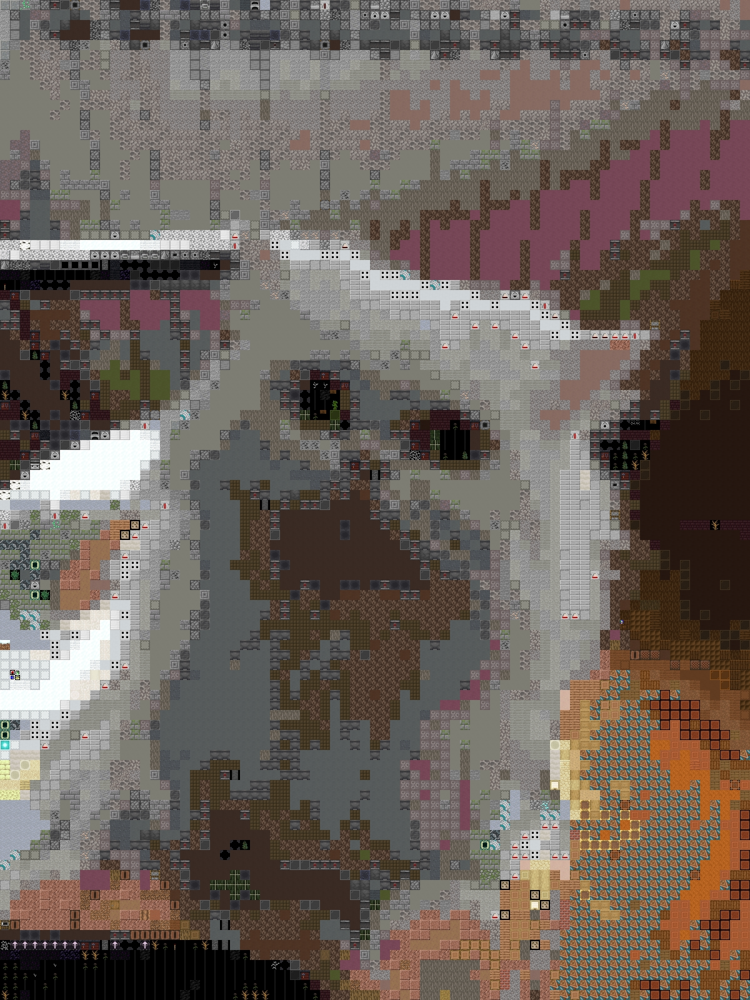
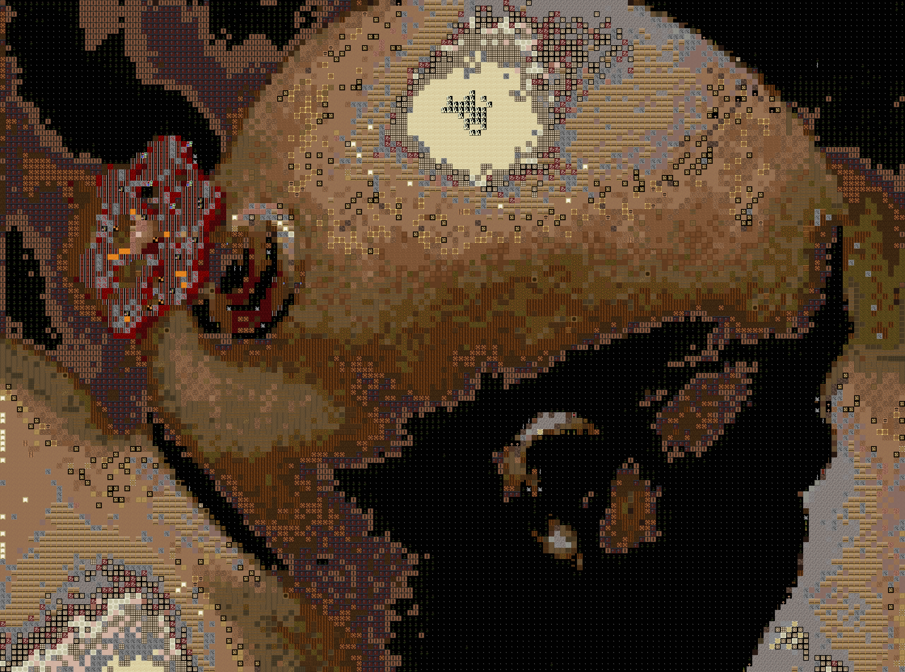

# Image mozaic using Minecraft's textures

Simple program that converts regular images into images composed of minecraft textures. I used this project idea to learn about Boost's GIL library.

The program uses histogram method to find similarities between textures and parts of the image.

## Examples

**Warning:** huge pictures.

Picture of a cat.

Higher resolution.

Toscana, Italy.

Valve's old logo.

